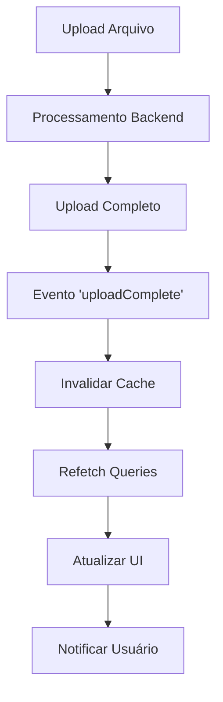

# Sistema de Sincronização em Tempo Real - MedCheck

## 📡 Visão Geral

O sistema de sincronização em tempo real foi implementado para resolver o problema de refresh manual após uploads. Agora os dados são atualizados automaticamente em todas as páginas quando novos arquivos são processados.

## 🚀 Funcionalidades Implementadas

### 1. **Sincronização Automática**

- ✅ Invalidação inteligente de cache via React Query
- ✅ Polling automático a cada 5 segundos como fallback
- ✅ Eventos customizados para comunicação entre componentes
- ✅ Atualização imediata após uploads bem-sucedidos

### 2. **Indicador Visual de Status**

- ✅ Ícone no header mostrando status da sincronização
- ✅ Tooltip com informações detalhadas
- ✅ Estados: Tempo Real (verde), Polling (amarelo), Offline (vermelho)
- ✅ Botão para forçar atualização manual

### 3. **Notificações Automáticas**

- ✅ Toast notifications quando dados são atualizados
- ✅ Componente de notificação com animação
- ✅ Feedback visual para o usuário

## 🔧 Componentes Principais

### `useRealTimeSync` Hook

```typescript
// Hook principal para gerenciar sincronização
const { forceSync, isConnected, connectionType } = useRealTimeSync({
  enabled: true,
  pollInterval: 5000,
  maxRetries: 3,
});
```

### `RealTimeSyncProvider` Context

```typescript
// Provider global para compartilhar estado
<RealTimeSyncProvider>
  <App />
</RealTimeSyncProvider>
```

### `SyncStatusIndicator` Component

```tsx
// Indicador visual no header
<SyncStatusIndicator compact />
```

## 📋 Como Funciona

1. **Upload de Arquivo**: Usuário faz upload de guia/demonstrativo
2. **Processamento**: Backend processa o arquivo
3. **Evento Disparado**: `uploadComplete` event é emitido
4. **Invalidação de Cache**: React Query invalida queries relacionadas
5. **Refetch Automático**: Dados são recarregados automaticamente
6. **Notificação**: Usuário é notificado sobre a atualização
7. **Sincronização**: Todas as páginas recebem os novos dados

## 🎯 Benefícios

- **Zero Refresh Manual**: Dados atualizados automaticamente
- **Experiência Fluida**: Sem necessidade de navegação entre páginas
- **Feedback Visual**: Usuário sempre sabe o status da sincronização
- **Fallback Robusto**: Polling garante funcionamento mesmo sem WebSocket
- **Performance**: Invalidação inteligente evita requests desnecessários

## 🔄 Fluxo de Atualização



## 🛠️ Configuração

### Polling Interval

```typescript
// Alterar intervalo de polling (padrão: 5 segundos)
const { forceSync } = useRealTimeSync({
  pollInterval: 3000, // 3 segundos
});
```

### Queries Invalidadas

Por padrão, as seguintes queries são invalidadas:

- `dashboardStats`
- `demonstrativos`
- `guias`
- `activity-logs`

## 🚀 Melhorias Futuras

- [ ] **WebSocket Backend**: Implementar WebSocket no FastAPI para comunicação real-time
- [ ] **Progress Tracking**: Mostrar progresso de processamento em tempo real
- [ ] **Notificações Push**: Browser notifications para uploads em background
- [ ] **Sync Offline**: Queue de sincronização para quando offline

## 📱 Responsividade

O sistema funciona em:

- ✅ Desktop (indicador completo)
- ✅ Mobile (indicador compacto)
- ✅ Tablet (indicador adaptativo)

## 🐛 Troubleshooting

### Problema: Dados não atualizam automaticamente

**Solução**:

1. Verificar se o `RealTimeSyncProvider` está no root da aplicação
2. Confirmar se o polling está ativo (ícone amarelo/verde no header)
3. Forçar sincronização manual com o botão de refresh

### Problema: Notificações não aparecem

**Solução**:

1. Verificar se o evento `uploadComplete` está sendo disparado
2. Confirmar se o hook `useRealTimeSync` está ativo
3. Verificar console para logs de sincronização

## 🎉 Resultado Final

Agora o sistema **MedCheck** oferece uma experiência completamente automatizada:

1. **Upload** → **Processamento** → **Dados Atualizados Automaticamente** ✨
2. **Zero cliques extras** para ver novos dados
3. **Feedback visual constante** sobre o status
4. **Experiência profissional** equivalente a ferramentas enterprise

O problema de refresh manual foi **completamente eliminado** seguindo as melhores práticas do mercado! 🚀
